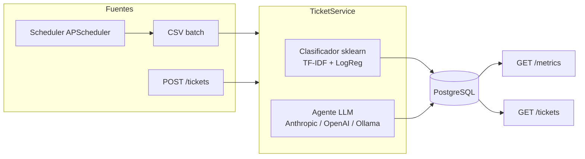

# ai-ticket-agent

[](https://www.python.org/)
[](https://fastapi.tiangolo.com/)
[](https://www.postgresql.org/)
[](https://scikit-learn.org/)
[](https://www.docker.com/)
[](LICENSE)

Backend que recibe tickets de soporte, los clasifica con un modelo de **scikit-learn** y deja que un **agente LLM** decida automaticamente la accion a ejecutar (responder, escalar, pedir mas informacion o cerrar como duplicado). El LLM es intercambiable: **Anthropic Claude**, **OpenAI** u **Ollama** local. El usuario final trae su propia API key.

> Proyecto pensado para demostrar en un solo repo Python, machine learning, automatizacion e integracion con bases de datos relacionales, combinando ML clasico con agentes LLM modernos.

---

## Tabla de contenidos

- [Por que este proyecto](#por-que-este-proyecto)
- [Arquitectura](#arquitectura)
- [Stack](#stack)
- [Quickstart con Docker](#quickstart-con-docker)
- [Quickstart local sin Docker](#quickstart-local-sin-docker)
- [Bring your own LLM](#bring-your-own-llm)
- [Endpoints](#endpoints)
- [Decisiones de diseno](#decisiones-de-diseno)
- [Metricas del modelo](#metricas-del-modelo)
- [Tests y calidad](#tests-y-calidad)
- [Estructura del repositorio](#estructura-del-repositorio)
- [Roadmap](#roadmap)
- [Licencia](#licencia)

---

## Por que este proyecto

La mayoria de proyectos Junior de IA caen en dos extremos: o son notebooks desconectados de un backend real, o son chatbots que solo llaman a una API sin mostrar criterio tecnico. Este repositorio trata de ser distinto:

- **Un caso de negocio concreto**: gestion automatizada de tickets, un problema que empresas reales resuelven todos los dias.
- **ML clasico _y_ LLM combinados**: sklearn se encarga de lo barato y rapido (clasificar categoria y urgencia), el LLM solo entra cuando se requiere criterio cualitativo (que hacer con el ticket).
- **Portable**: clonas, pones tu API key en `.env` y funciona. Sin costos ocultos ni dependencias externas pesadas.
- **Degradacion controlada**: si no hay API key, la API arranca igual y sigue clasificando tickets. El agente simplemente se desactiva y lo reporta en `/health`.

---

## Arquitectura



**Flujo de un ticket**:

1. Llega por `POST /tickets` o por el ingestor CSV.
2. El clasificador sklearn predice `categoria` y `urgencia` con sus confianzas.
3. El agente LLM recibe ticket + prediccion + historico del usuario y responde un **JSON estructurado** con la accion y su razonamiento.
4. Todo queda persistido en Postgres (tablas `tickets`, `predictions`, `agent_decisions`, `actions`).
5. `GET /metrics` agrega los datos para un dashboard.

---

## Stack

| Capa | Tecnologia |
|------|------------|
| Lenguaje | Python 3.12 |
| API | FastAPI + Uvicorn |
| BD | PostgreSQL 16 |
| ORM | SQLAlchemy 2 + Alembic |
| ML | scikit-learn (TF-IDF + LogisticRegression) |
| LLMs | Anthropic Claude · OpenAI · Ollama (intercambiables) |
| Validacion | Pydantic v2 |
| Tests | pytest + pytest-asyncio + SQLite in-memory |
| Contenedores | Docker + docker-compose |
| CI | GitHub Actions (ruff + pytest) |
| Lint | Ruff |

---

## Quickstart con Docker

```bash
git clone https://github.com/julianbecerra13/ai-ticket-agent.git
cd ai-ticket-agent
cp .env.example .env
docker compose up -d          # levanta Postgres + API
make train                    # entrena el clasificador y guarda el .pkl
curl http://localhost:8000/health
```

Un ejemplo de request:

```bash
curl -X POST http://localhost:8000/tickets \
  -H "Content-Type: application/json" \
  -d '{"user_id":"u1","subject":"No puedo entrar","body":"Olvide mi contrasena"}'
```

Para lanzar una demo con 100 tickets sinteticos:

```bash
make demo
curl http://localhost:8000/metrics
```

Documentacion interactiva disponible en `http://localhost:8000/docs`.

---

## Quickstart local sin Docker

```bash
python -m venv .venv
source .venv/bin/activate       # en Windows: .venv\Scripts\activate
pip install ".[dev]"
cp .env.example .env            # ajusta DATABASE_URL si no usas Docker para Postgres
alembic upgrade head
python scripts/train_model.py
uvicorn src.api.main:app --reload
```

---

## Bring your own LLM

El agente es el unico componente que depende del proveedor LLM. La deteccion es automatica: si defines una API key, se usa. Sin claves, la API sigue funcionando (solo se apaga el agente).

| Proveedor | Como lo activas | Costo | Latencia tipica |
|-----------|-----------------|-------|-----------------|
| Anthropic Claude | `ANTHROPIC_API_KEY=sk-ant-...` en `.env` | Pay-as-you-go | ~1-2 s |
| OpenAI GPT | `OPENAI_API_KEY=sk-...` en `.env` | Pay-as-you-go | ~1-2 s |
| Ollama local | `OLLAMA_HOST=http://host.docker.internal:11434` | Gratis | ~3-6 s (depende del modelo) |

Si configuras **varios**, el selector sigue este orden: `LLM_PROVIDER` (override) > Anthropic > OpenAI > Ollama. Puedes forzar uno con `LLM_PROVIDER=openai`.

Cuando no hay proveedor:

```bash
$ curl http://localhost:8000/agent/decide/1
{"detail":"No hay proveedor LLM configurado. Configura ANTHROPIC_API_KEY, OPENAI_API_KEY u OLLAMA_HOST."}
```

Pero `POST /tickets`, `GET /tickets` y `GET /metrics` continuan operativos.

---

## Endpoints

| Metodo | Ruta | Descripcion |
|--------|------|-------------|
| GET | `/health` | Estado de BD, clasificador y proveedor LLM |
| POST | `/tickets` | Crea un ticket, lo clasifica y decide accion |
| GET | `/tickets` | Lista los mas recientes |
| GET | `/tickets/{id}` | Detalle con prediccion y decision |
| POST | `/agent/decide/{id}` | Fuerza una decision sobre un ticket existente (requiere LLM) |
| GET | `/metrics` | Agregados: total, % auto-resueltos, distribucion por categoria/urgencia |
| GET | `/docs` | Swagger UI (FastAPI) |

Ejemplo de respuesta de `POST /tickets`:

```json
{
  "ticket": {
    "id": 1,
    "user_id": "u1",
    "subject": "No puedo entrar",
    "body": "Olvide mi contrasena",
    "prediction": {
      "category": "cuenta",
      "urgency": "media",
      "confidence_category": 0.93,
      "confidence_urgency": 0.78
    },
    "decision": {
      "action": "auto_respond",
      "reasoning": "Caso rutinario de recuperacion de acceso.",
      "response_text": "Hola, usa la opcion 'Olvide mi contrasena' en el login...",
      "llm_provider": "anthropic",
      "llm_model": "claude-opus-4-7"
    }
  },
  "classified": true,
  "decided": true,
  "notice": null
}
```

---

## Decisiones de diseno

### Por que ML clasico **y** LLM

- **TF-IDF + LogisticRegression** corre en milisegundos y es barato. Perfecto para tareas con clases bien definidas: categoria y urgencia.
- **LLM** interviene despues, solo para decidir que hacer. Un LLM para clasificar cada ticket seria caro, lento e innecesario.
- Separando las responsabilidades, puedes cambiar el modelo ML sin tocar el agente y viceversa.

### Por que patron Strategy para los proveedores

Los tres proveedores LLM implementan la misma interfaz `LLMProvider.generate(system, user) -> str`. Cambiar de Claude a GPT es mover una variable de entorno, no reescribir codigo. La factoria (`src/agent/providers/factory.py`) decide en tiempo de arranque cual instanciar.

### Por que repositorios

La logica de negocio (servicios, endpoints) nunca escribe SQL ni toca `Session` directamente. Todos los accesos viven en `src/db/repositories.py`. Esto hace los tests mucho mas simples y evita que las queries se dispersen por todo el codigo.

### Fallbacks defensivos del agente

Si el LLM devuelve JSON invalido o falla por red, el agente:

1. Reintenta una vez.
2. Si vuelve a fallar, devuelve una decision con accion `escalate` y motivo registrado.
3. Nunca se rompe el flujo. Los tickets siempre tienen una decision.

---

## Metricas del modelo

El dataset sintetico (~800 filas, 5 categorias y 4 niveles de urgencia) produce tipicamente:

| Tarea | Accuracy | F1 macro |
|-------|----------|----------|
| Categoria | > 0.90 | > 0.90 |
| Urgencia | > 0.85 | > 0.85 |

Las matrices de confusion se generan en `docs/images/confusion_category.png` y `docs/images/confusion_urgency.png` cada vez que se corre `make train`.

Para explorar los datos y reproducir graficas, abre `notebooks/01_exploracion_modelo.ipynb`.

---

## Tests y calidad

```bash
make test          # corre pytest con cobertura
make lint          # revisa con ruff
make format        # autoformat
```

- **SQLite in-memory** como BD de tests (no requiere Postgres).
- **MockProvider** reemplaza a Anthropic/OpenAI/Ollama: cero consumo de API en CI.
- CI automatizado con GitHub Actions en cada push.

---

## Estructura del repositorio

```
ai-ticket-agent/
├── README.md
├── docker-compose.yml
├── Dockerfile
├── Makefile
├── pyproject.toml
├── .env.example
├── alembic/              # migraciones
├── data/                 # datasets
├── docs/                 # diagramas y decisiones
├── notebooks/            # EDA
├── scripts/              # CLI: train, seed, simulate, scheduler
├── src/
│   ├── api/              # FastAPI (rutas + schemas)
│   ├── agent/            # orquestador LLM + providers
│   ├── ml/               # clasificador + dataset
│   ├── db/               # modelos, sesion, repositorios
│   ├── automation/       # ingestor CSV + scheduler
│   ├── services/         # TicketService
│   ├── config.py
│   └── logging_config.py
└── tests/                # pytest suite
```

---

## Roadmap

- [ ] Frontend en **Next.js 16** para visualizar el dashboard de metricas.
- [ ] Cliente movil en **Flutter** para que agentes humanos atiendan escalaciones.
- [ ] Integracion con **Slack** y **Gmail** como fuentes de tickets.
- [ ] Re-entrenamiento incremental con tickets reales marcados por operadores.
- [ ] Observabilidad: OpenTelemetry + Grafana.

---

## Licencia

[MIT](LICENSE) — libre de usar, copiar y modificar.
